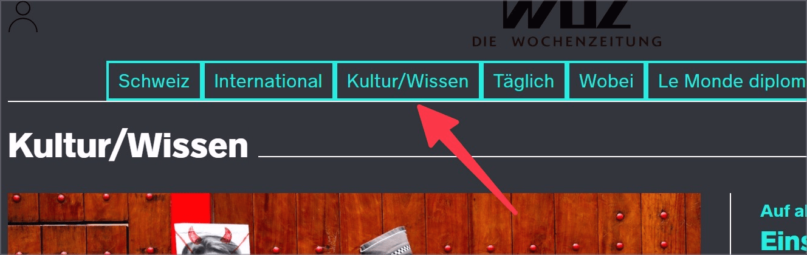

# ✅ High contrast mode

Wcag criterion: [📜 1.1.1 Non-text Content - A](..)

## Description

Informative graphics and graphical elements (e.g. a tick in an activated checkbox, highlighting the active element in a navigation or the border of a text field) are visible in forced colors mode.

## Method

Activate **Windows High Contrast Mode** (up to Windows 10: `Alt` + `Shift` + `PrtScn`; from Windows 11: `System Settings` → `Accessibility` → `Contrast Designs` → `Night Sky` or similar): Are all informative graphics still visible?

## Details on web applicability (specific test steps)

🇩🇪 Currently only available in German.

## Screenshots

