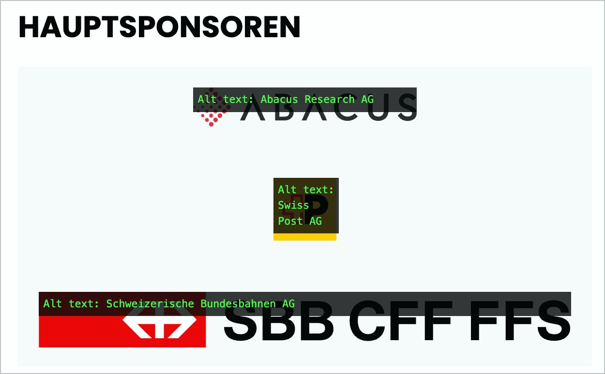
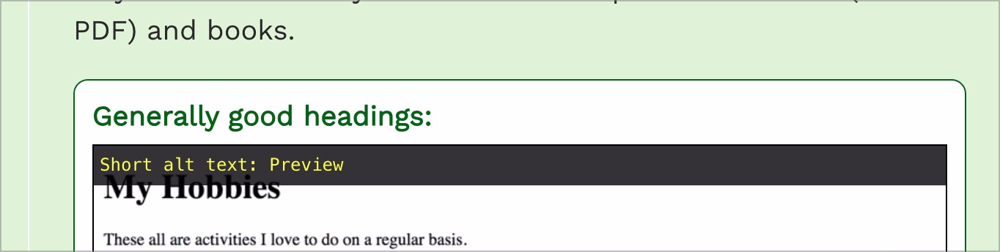

# ✅ Linked graphics

Wcag criterion: [📜 1.1.1 Non-text Content - A](..)

## Description

Linked graphics have an alternative text that describes the link target or purpose.

## Method

**Web Developer Toolbar:** Images > Display Alt Attributes: Match displayed alternative texts with images.

## Details on web applicability (specific test steps)

🇩🇪 Currently only available in German.

## Details on mobile applicability (additions to web)

🇩🇪 Currently only available in German.

## Details on PDF applicability (additions to web)

🇩🇪 Currently only available in German.

## Blind testable details

🇩🇪 Currently only available in German.

## Screenshots

## Videos

🇩🇪 Currently only available in German.
