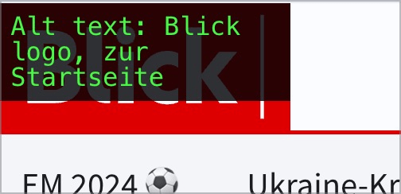
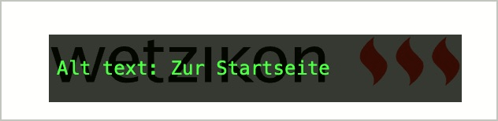

# ✅ Linked page logo

## Description

The page logo (with link to the homepage) has a meaningful text alternative (pattern `alt="Logo company name, to homepage"`)

## Method

**Web Developer Toolbar:** Images > Display Alt Attributes: Match displayed alternative texts with images.

## Details on web applicability (specific test steps)

🇩🇪 Currently only available in German.

## Screenshots

