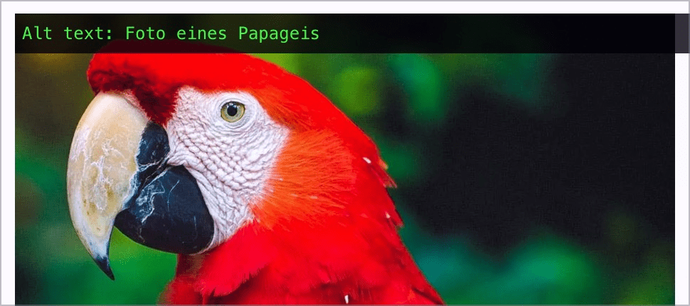

# ✅ Redundancy in alternative texts

## Description

Alternative texts for graphics do not contain any redundant information, e.g. information that already exists in a caption or link text or information such as `"Graphic ..."`, `"Image ..."`.

## Method

**Web Developer Toolbar:** Images > Display Alt Attributes: Match displayed alternative texts with images.

## Details on web applicability (specific test steps)

🇩🇪 Currently only available in German.

## Screenshots

