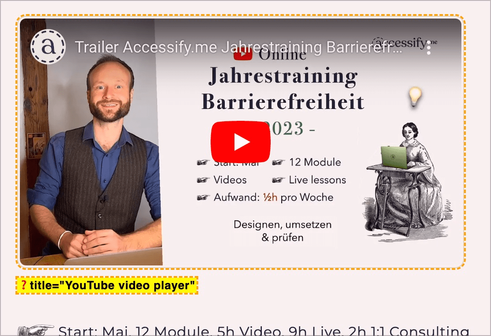

# ✅ Video and audio titles

Wcag criterion: [📜 1.1.1 Non-text Content - A](..)

## Description

Video and audio content has an alternative text that conveys the title and/or a short description.

## Method

**Manual check:** Compare alternative text with content: Is the title or paraphrase appropriate?

## Details on web applicability (specific test steps)

🇩🇪 Currently only available in German.

## Details on mobile applicability (additions to web)

🇩🇪 Currently only available in German.

## Details on PDF applicability (additions to web)

🇩🇪 Currently only available in German.

## Blind testable details

🇩🇪 Currently only available in German.

## Screenshots

## Videos

🇩🇪 Currently only available in German.
