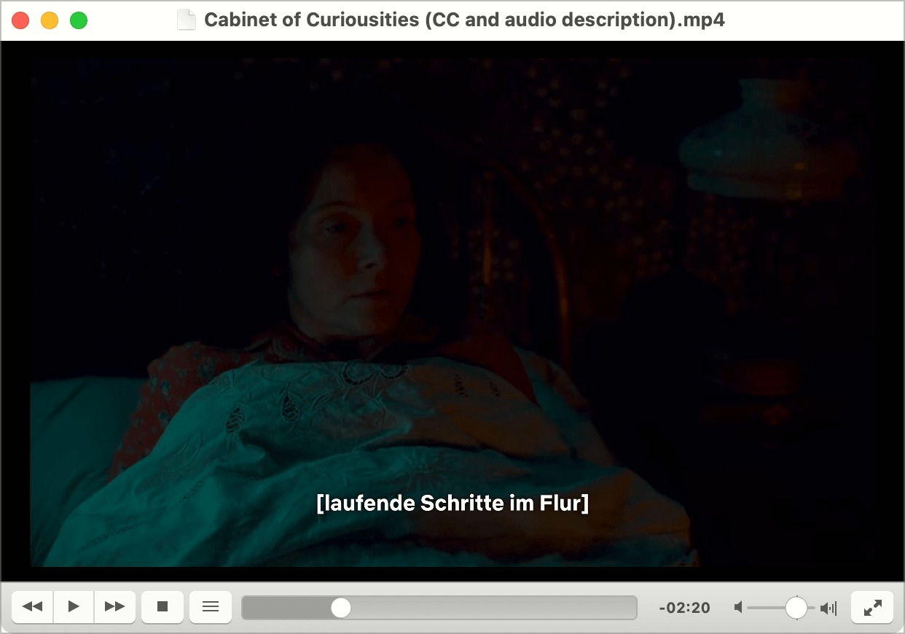

# ✅ Subtitle

Wcag criterion: [📜 1.2.2 Captions (Prerecorded) - A](..)

## Description

Equivalent, synchronised subtitles exist for recorded video content with audio (e.g. feature films).

## Method

**Manual check:** Compare subtitles with spoken words: Is the content equivalent?

## Details on web applicability (specific test steps)

🇩🇪 Currently only available in German.

## Screenshots

### YouTube

YouTube erstellt Untertitel automatisch. Sie können manuell ein-/ausgeblendet werden (Closed Captions).

### SwissID

Das Video von SwissID benötigt keine spezifische Untertitelung, da alle Texte schon im Video selber angezeigt werden.

### Netflix

Ein Horrorfilm lebt stark von teils sehr subtilen Audio-Effekten, ohne dass man deren Ursprung sieht (etwa "laufende Schritte im Flur", während die Kamera auf eine Person im Bett gerichtet ist).
