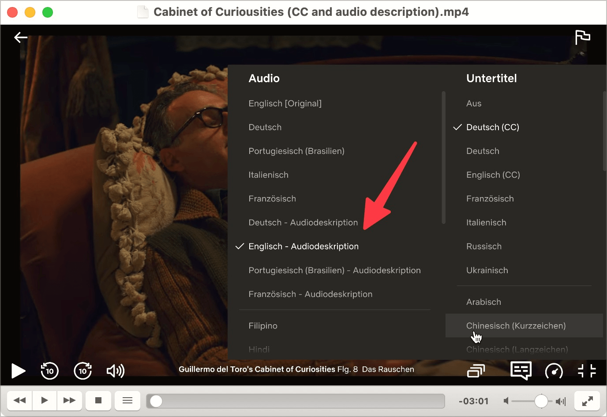

# ✅ Audio description

Wcag criterion: [📜 1.2.5 Audio Description (Prerecorded) - AA](..)

## Description

Audio descriptions exist for synchronised video content (videos in which the audio and video tracks together provide the complete information) for purely visual content relevant to the content. The following applies to audio description: If all the information in the video track is already contained in the audio track, no audio description is required.

(This checkpoint can be disregarded if conformance level A is the aim and therefore 1.2.3 is in force. To achieve conformance level A, synchronised video content requires either a text transcript or an audio description. For conformance level AA, an audio description is always required).

## Method

**Manual check:** Compare audio description with video content, including purely visually perceptible action: Is the content equivalent?

## Details on web applicability (specific test steps)

🇩🇪 Currently only available in German.

## Details on mobile applicability (additions to web)

🇩🇪 Currently only available in German.

## Details on PDF applicability (additions to web)

🇩🇪 Currently only available in German.

## Blind testable details

🇩🇪 Currently only available in German.

## Screenshots

Many newer films on Netflix offer audio descriptions.

## Videos

No videos available.
