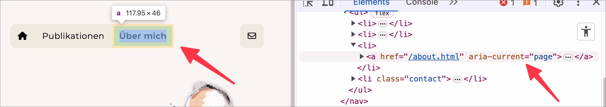

# ✅ Active elements

Wcag criterion: [📜 1.3.1 Info and Relationships - A](..)

## Description

Active elements (e.g. the active menu item in a navigation) are semantically recognisable if they are clearly visually identifiable as active.

## Method

**Screenreader:** Explore and check output: Are active points recognisable as such?

## Details on web applicability (specific test steps)

🇩🇪 Currently only available in German.

## Details on mobile applicability (additions to web)

🇩🇪 Currently only available in German.

## Details on PDF applicability (additions to web)

🇩🇪 Currently only available in German.

## Blind testable details

🇩🇪 Currently only available in German.

## Screenshots

## Videos

- [🎬 Aktiver Menü-Eintrag bei Hochkontrast nicht mehr erkennbar - EWB](/en/videos/aktiver-menu-eintrag-bei-hochkontrast-nicht-mehr-erkennbar-ewb)
- [🎬 Aktiver Menü-Eintrag wird nicht angesagt - EWB](/en/videos/aktiver-menu-eintrag-wird-nicht-angesagt-ewb)
