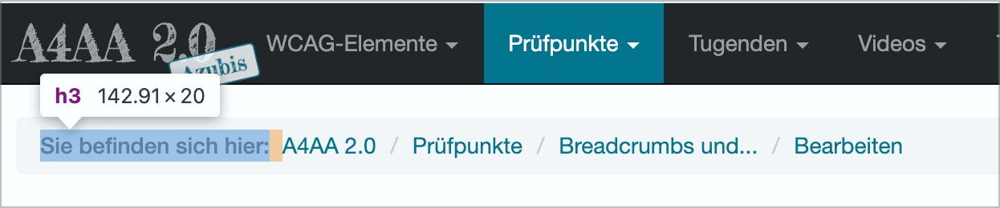
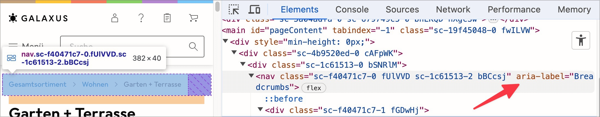

# ✅ Breadcrumbs and process displays

Wcag criterion: [📜 1.3.1 Info and Relationships - A](..)

## Description

Breadcrumbs or process displays can also be recognised as such non-visually.

## Method

**Screenreader:** Explore and check output: Are the output elements recognisable as such?

## Details on web applicability (specific test steps)

🇩🇪 Currently only available in German.

## Screenshots

