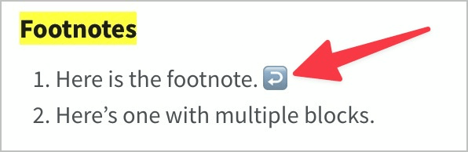

# ✅ Footnotes

Wcag criterion: [📜 1.3.1 Info and Relationships - A](..)

## Description

Footnotes are implemented barrier-free: The footnote text can also be accessed with a screen reader without losing the original context.

## Method

**Screenreader:** Explore elements, interact with them and check output: Is the related information easy to find? Is the navigation between text and footnote successful?

## Details on web applicability (specific test steps)

🇩🇪 Currently only available in German.

## Screenshots

