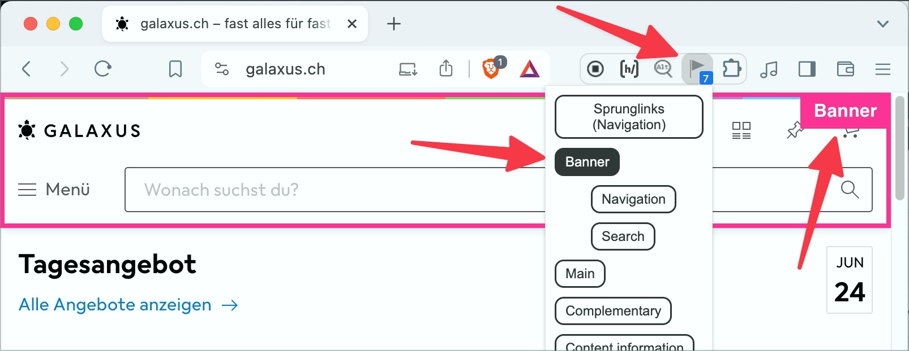
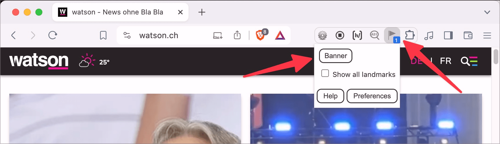

# ✅ Landmarks

Wcag criterion: [📜 1.3.1 Info and Relationships - A](..)

## Description

Landmark roles (HTML5 elements such as `<header>`, `<main>`, etc. as well as ARIA roles) are assigned correctly. They are used carefully and consistently (no multiple use of the same role if possible, consistent labelling of all important page areas).

## Method

**Screenreader:** Explore and check output: Are page areas output as such recognisable?

## Details on web applicability (specific test steps)

🇩🇪 Currently only available in German.

## Details on mobile applicability (additions to web)

🇩🇪 Currently only available in German.

## Details on PDF applicability (additions to web)

🇩🇪 Currently only available in German.

## Blind testable details

🇩🇪 Currently only available in German.

## Screenshots

