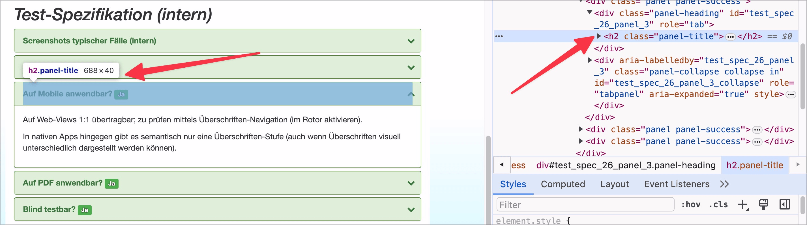

# ✅ Headings for accordions

Wcag criterion: [📜 1.3.1a Headings structure](..)

## Description

Headings for accordions are implemented as such.

## Method

**Bookmarklet h123:** Execute and compare with page: Are headings in accordions implemented as such?

## Details on web applicability (specific test steps)

🇩🇪 Currently only available in German.

## Screenshots

