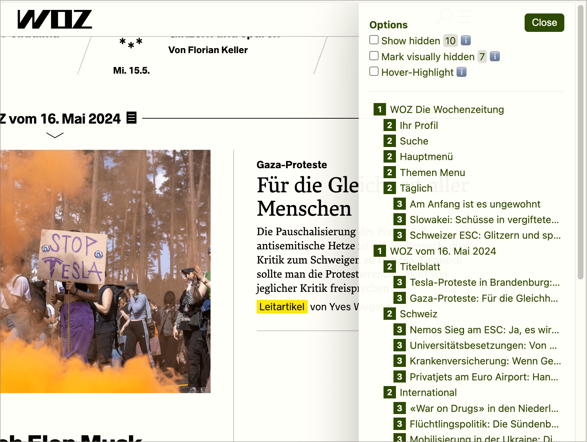

# ✅ Hierarchy of existing headings

## Description

The hierarchy of the heading levels is logically correct in terms of content and conveys the structure of the content.

## Method

**Bookmarklet h123:** Execute and compare with page: Is the hierarchy logically correct?

## Details on web applicability (specific test steps)

🇩🇪 Currently only available in German.

## Screenshots

