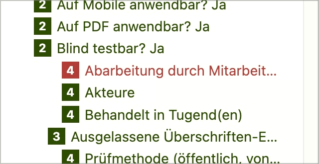

# ✅ Jumps between heading levels

Wcag criterion: [📜 1.3.1a Headings structure](..)

## Description

If possible, there are no jumps between heading levels, whereby a single level is tolerated (e.g. `<h2>` to `<h4>`, but not to `<h5>`). However, the first heading does not necessarily have to be an `<h1>`.

## Method

Execute **Bookmarklet h123:** and search for jumps in the hierarchy.

## Details on web applicability (specific test steps)

🇩🇪 Currently only available in German.

## Screenshots

