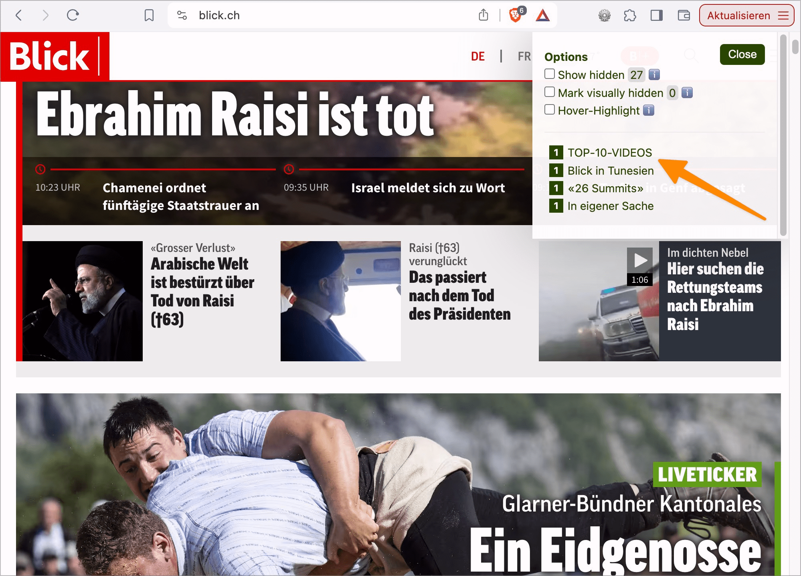

# ✅ Own heading

Wcag criterion: [📜 1.3.1a Headings structure](..)

## Description

Independent page areas have their own heading, otherwise they will be incorrectly subordinated to the preceding heading. Visually hidden headings can be used for content and function blocks such as header and footer, navigation, breadcrumb, etc.

## Method

**Bookmarklet h123:** Execute and compare with page: Does each page section have a heading? Is their labeling correct?

## Details on web applicability (specific test steps)

🇩🇪 Currently only available in German.

## Screenshots

