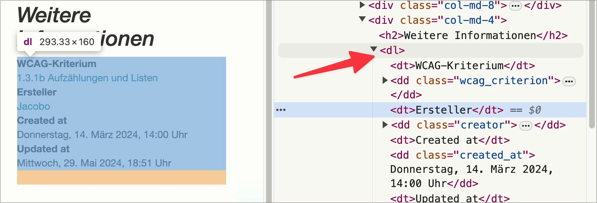

# ✅ Glossaries

## Description

Glossaries and similar information lists are formatted as definition lists.

## Method

**Bookmarklet "Contents organized":** Execute and compare with page.

## Details on web applicability (specific test steps)

🇩🇪 Currently only available in German.

## Screenshots

