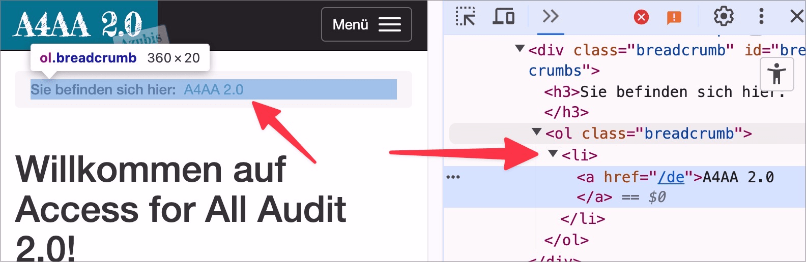

# ✅ Lists with only one entry

Wcag criterion: [📜 1.3.1b Use of Lists](..)

## Description

Lists with only one entry are avoided (unless they are generated automatically: for example, a list of keywords, where sometimes there is only a single keyword).

## Method

**Bookmarklet "Contents organized":** Execute and compare with page: Does each list have at least two elements?

## Details on web applicability (specific test steps)

🇩🇪 Currently only available in German.

## Details on mobile applicability (additions to web)

🇩🇪 Currently only available in German.

## Details on PDF applicability (additions to web)

🇩🇪 Currently only available in German.

## Blind testable details

🇩🇪 Currently only available in German.

## Screenshots

