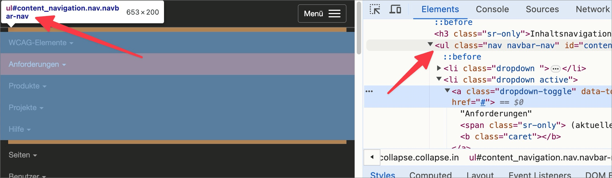

# ✅ Semantically correct enumerations

Wcag criterion: [📜 1.3.1b Use of Lists](..)

## Description

Enumerations are semantically correctly formatted as lists (`<ul>`, `<ol>`, `<dl>`).

## Method

**Bookmarklet "Contents organized":** Execute and compare with page: Are bulleted lists marked as such?

## Details on web applicability (specific test steps)

🇩🇪 Currently only available in German.

## Screenshots

