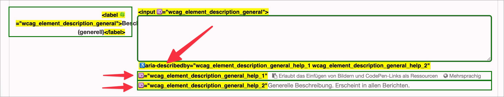

# ✅ Text elements between input fields

Wcag criterion: [📜 1.3.1c Forms, Labels and Fieldsets](..)

## Description

Text elements that are located between the input fields (e.g. an `<h3>` or `
`) are linked to the relevant form fields (e.g. with `aria-describedby`) so that they can also be recognized with screen readers when the fields are in focus.

## Method

**Screenreader:** Navigate through input fields using the 'Tab' key and check whether relevant text elements are also displayed.

## Details on web applicability (specific test steps)

🇩🇪 Currently only available in German.

## Screenshots

