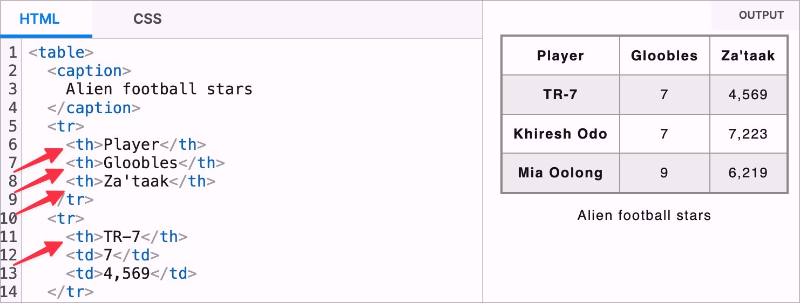
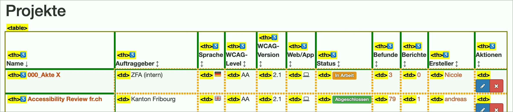

# ✅ Column or row title

Wcag criterion: [📜 1.3.1d Tabular data](..)

## Description

Data tables have column or row titles (`<th>`), ideally both.

## Method

**Web Developer Toolbar:** Outline > Activate "Show Element Tag Names" > Outline Table Cells: Explore table and check whether corresponding `<th>` elements are present.

## Details on web applicability (specific test steps)

🇩🇪 Currently only available in German.

## Details on mobile applicability (additions to web)

🇩🇪 Currently only available in German.

## Details on PDF applicability (additions to web)

🇩🇪 Currently only available in German.

## Blind testable details

🇩🇪 Currently only available in German.

## Screenshots

## Videos

No videos available.
