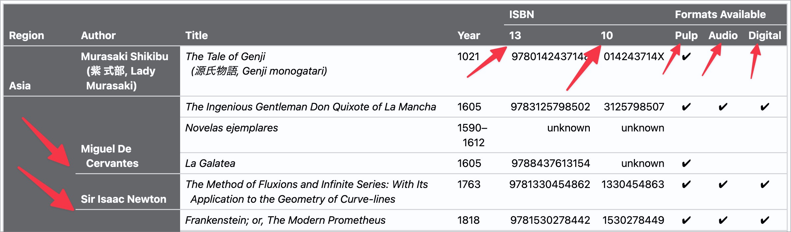

# ✅ Spanning cells

Wcag criterion: [📜 1.3.1d Tabular data](..)

## Description

Tables whose cells span several columns and/or rows are still easy to understand for screen readers.

## Method

**Navigate through the table and check whether the column and row titles are displayed correctly.

## Details on web applicability (specific test steps)

🇩🇪 Currently only available in German.

## Screenshots

