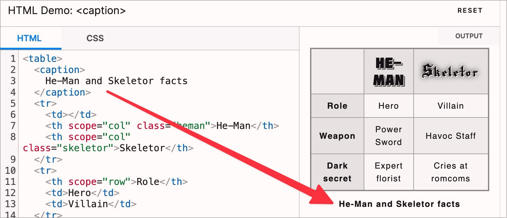

# ✅ Table headings

## Description

Complex data tables in particular have table headings (`<caption>`).

## Method

**Screenreader:** Explore table and check whether the `<caption>` element is also output.

## Details on web applicability (specific test steps)

🇩🇪 Currently only available in German.

## Screenshots

