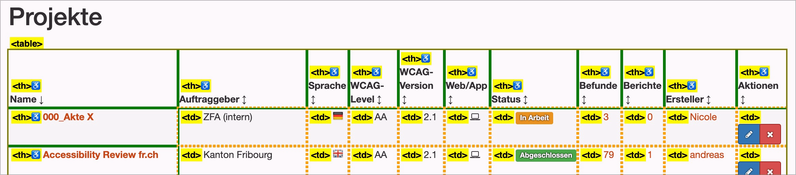

# ✅ Table semantically correct

Wcag criterion: [📜 1.3.1d Tabular data](..)

## Description

Data that is clearly tabular in nature (i.e. no layout tables) is semantically correctly formatted as a table and contains as few complex semantic structures as possible, e.g. heading elements (`<h1>` to `<h6>`).

## Method

**Web Developer Toolbar:** Outline > Activate "Show Element Tag Names" > Outline Table Cells: Explore table and check whether they are formatted semantically correctly.

## Details on web applicability (specific test steps)

🇩🇪 Currently only available in German.

## Screenshots

