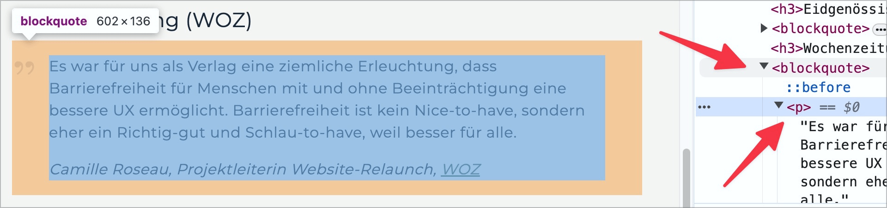

# ✅ Content semantically correct

Wcag criterion: [📜 1.3.1e Proper Semantic Markup](..)

## Description

Content is placed within semantically meaningful HTML elements (e.g. <h#>, 
, <ul>, <ol>, etc.); using 
 or  elements (which have no semantic relevance) is not sufficient.

## Method

**Bookmarklet "Structured Content":** Execute and check with the page: Are the contents placed in semantically meaningful containers?

## Details on web applicability (specific test steps)

🇩🇪 Currently only available in German.

## Details on mobile applicability (additions to web)

🇩🇪 Currently only available in German.

## Details on PDF applicability (additions to web)

🇩🇪 Currently only available in German.

## Blind testable details

🇩🇪 Currently only available in German.

## Screenshots

## Videos

- [🎬 Paragraf aufgeteilt in drei P-Elemente (forcierter Zeilenumbruch) - Atupri](/en/videos/paragraf-aufgeteilt-in-drei-p-elemente-forcierter-zeilenumbruch-atupri)
