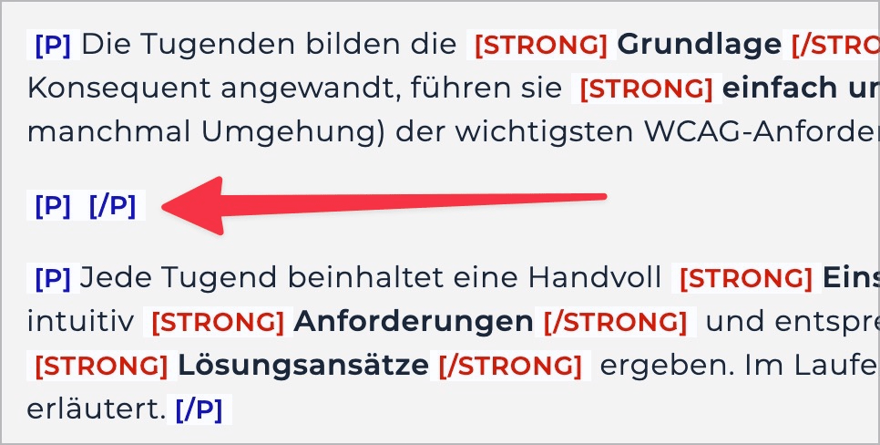

# ✅ Empty elements

Wcag criterion: [📜 1.3.1e Proper Semantic Markup](..)

## Description

Empty meaningful elements are avoided.

## Method

**Bookmarklet "Structured Content":** Execute and compare with the page: Are there any empty meaningful elements anywhere?

## Details on web applicability (specific test steps)

🇩🇪 Currently only available in German.

## Details on mobile applicability (additions to web)

🇩🇪 Currently only available in German.

## Details on PDF applicability (additions to web)

🇩🇪 Currently only available in German.

## Blind testable details

🇩🇪 Currently only available in German.

## Screenshots

## Videos

No videos available.
