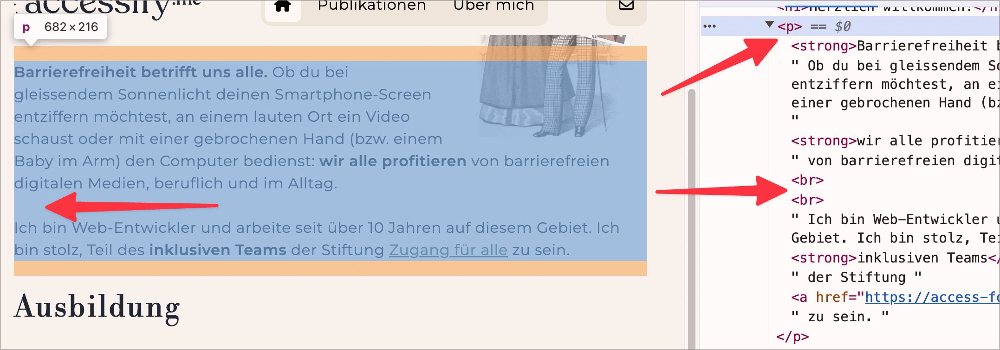

# ✅ Paragraphs semantically correct

## Description

Paragraphs are semantically correctly labelled, not just visually (e.g. using double ` `).

## Method

**Bookmarklet ‘’Contents organised‘’:** Execute and compare with page: Are paragraphs correctly marked? Are there any ` ` elements that stand out in an unfavourable way?

## Details on web applicability (specific test steps)

🇩🇪 Currently only available in German.

## Screenshots

