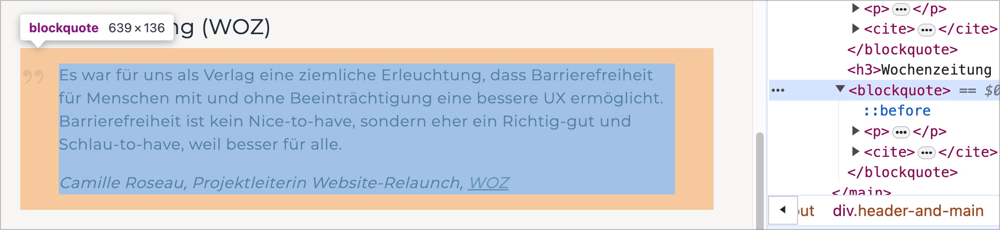
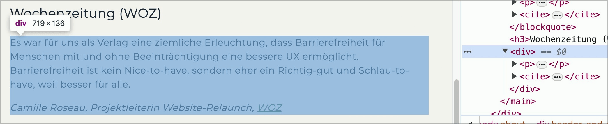

# ✅ Quotations semantically correct

Wcag criterion: [📜 1.3.1e Proper Semantic Markup](..)

## Description

Visually recognizable quotations are semantically correctly marked (e.g. as `<blockquote>` and `<cite>`) so that the respective text is also recognized as a quotation when assistive technologies are used.

## Method

**Bookmarklet "Content organized":** Execute and compare with page: Are citations marked as such?

## Details on web applicability (specific test steps)

🇩🇪 Currently only available in German.

## Screenshots

