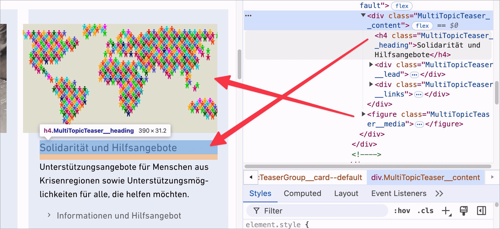

# ✅ Correct order

## Description

Content must be in the correct order in the code (DOM) (independent of CSS).

## Method

**Screenreader:** Explore content and check whether it is displayed in the expected order.

## Details on web applicability (specific test steps)

🇩🇪 Currently only available in German.

## Screenshots

