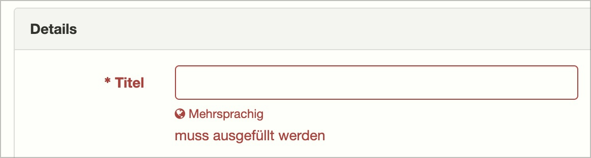

# ✅ Sensory information

Wcag criterion: [📜 1.3.3 Sensory Characteristics - A](..)

## Description

Content does not refer exclusively to sensory properties (purely visually recognisable, purely acoustically understandable), e.g. ‘Press the green button on the left’, ‘Correct the entries in the fields outlined in red’, ‘Click on the image on the right...’.

## Method

**Manual check:** Read through the contents and look for sensory properties.

## Details on web applicability (specific test steps)

🇩🇪 Currently only available in German.

## Details on mobile applicability (additions to web)

🇩🇪 Currently only available in German.

## Details on PDF applicability (additions to web)

🇩🇪 Currently only available in German.

## Blind testable details

🇩🇪 Currently only available in German.

## Screenshots

## Videos

🇩🇪 Currently only available in German.
