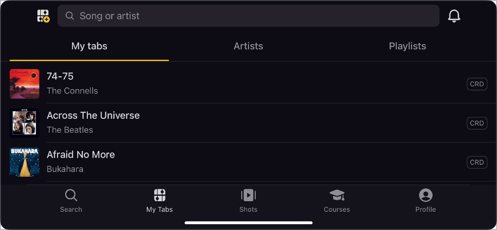

# ✅ Portrait and landscape format

## Description

Content is correctly displayed and usable in both screen orientations (portrait and landscape). If the content does not automatically adapt to the screen orientation, a switch is available to manually rotate the screen content (ensured by the browser for websites, ensured by design and development for mobile apps).

## Method

**Manual check:** Instead of using a real mobile device, various browsers can also simulate the rotation of the orientation, for example Firefox: Responsive Design Mode > Rotate View Port.

## Details on web applicability (specific test steps)

🇩🇪 Currently only available in German.

## Screenshots

