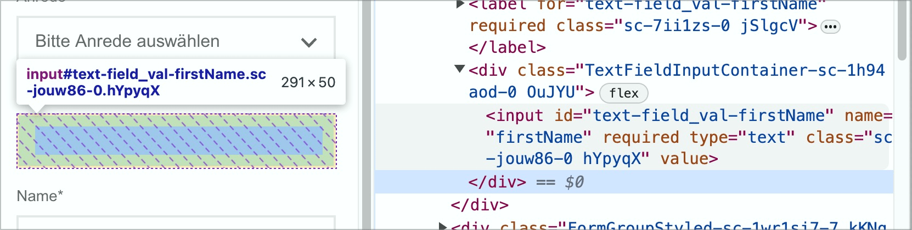
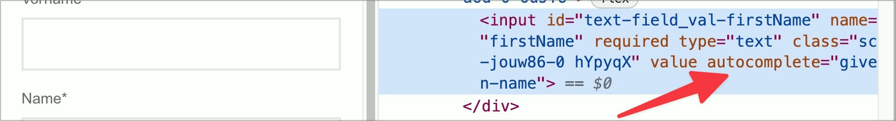

# ✅ Automatic completion

Wcag criterion: [📜 1.3.5 Identify Input Purpose - AA](..)

## Description

Input fields for user data can be filled in automatically.

## Method

**Web Developer Toolbar:** Forms > Display Form Details: Compare values of the `autocomplete` attribute with input fields.

## Details on web applicability (specific test steps)

🇩🇪 Currently only available in German.

## Details on mobile applicability (additions to web)

🇩🇪 Currently only available in German.

## Details on PDF applicability (additions to web)

🇩🇪 Currently only available in German.

## Blind testable details

🇩🇪 Currently only available in German.

## Screenshots

## Videos

No videos available.
