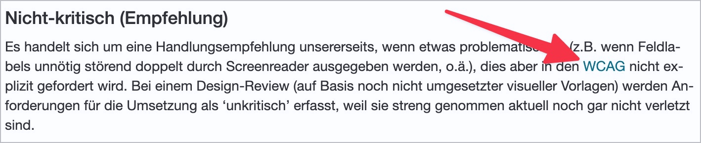
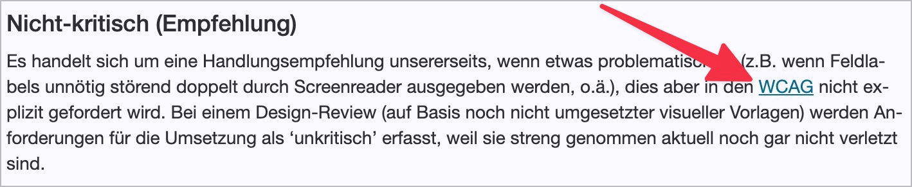
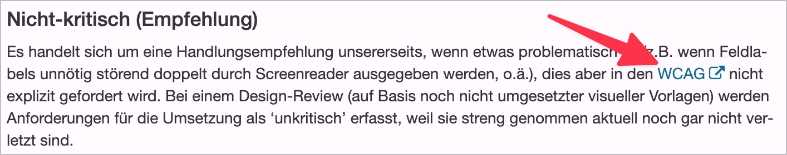

# ✅ Links in continuous text

## Description

If links within continuous text are distinguished from the continuous text only by colour, the contrast between the link and the surrounding continuous text must be at least 3:1. Alternatively, other visual markings of links may be used (e.g. underline, bold, frame, etc.).

## Method

**Manual check:** Look through the content and check for purely coloured links. Contrast determination by Colour Contrast Analyser if necessary.

## Details on web applicability (specific test steps)

🇩🇪 Currently only available in German.

## Screenshots

