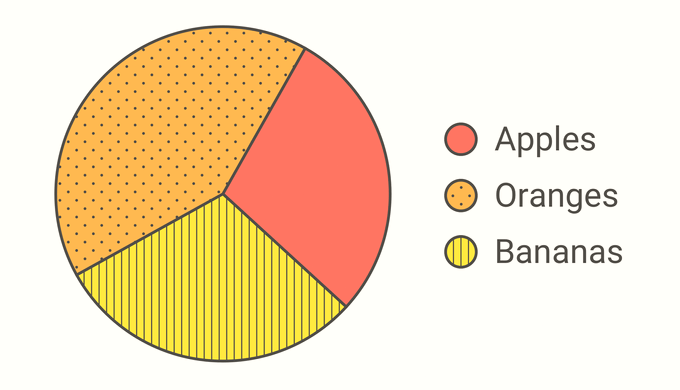

# ✅ Not just colour alone

Wcag criterion: [📜 1.4.1 Use of Color - A](..)

## Description

Information is not conveyed by colour alone. This is also true for hover and focus states. When information is conveyed by colour (e.g. parts of text highlighted in red to indicate their importance), there is another visual stimulus to convey this information (e.g. bold or underlined text, different icons, additional text).

## Method

**Manual check:** Review content and look for information provided purely in colour. Contrast determination by Colour Contrast Analyser if necessary.

## Details on web applicability (specific test steps)

🇩🇪 Currently only available in German.

## Details on mobile applicability (additions to web)

🇩🇪 Currently only available in German.

## Details on PDF applicability (additions to web)

🇩🇪 Currently only available in German.

## Blind testable details

🇩🇪 Currently only available in German.

## Screenshots

## Videos

No videos available.
