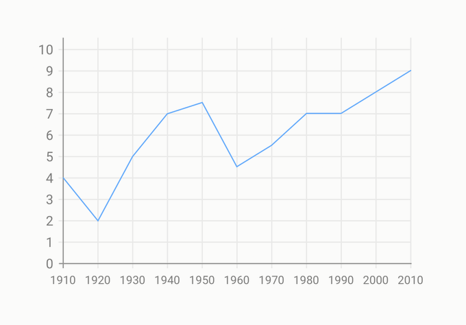
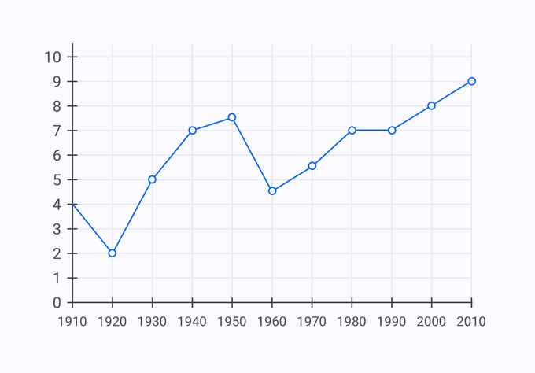
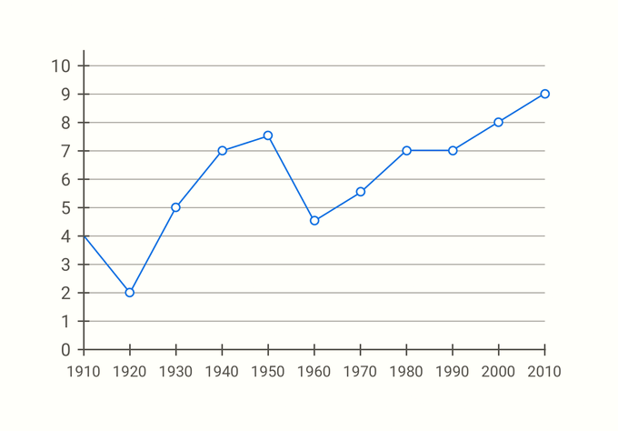
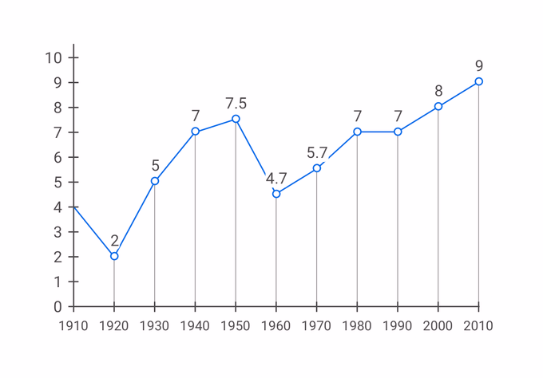
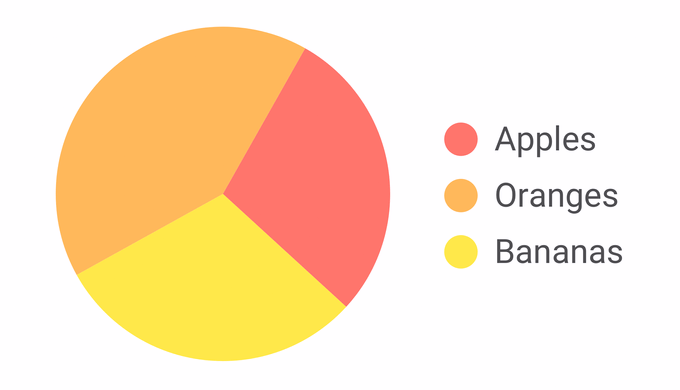
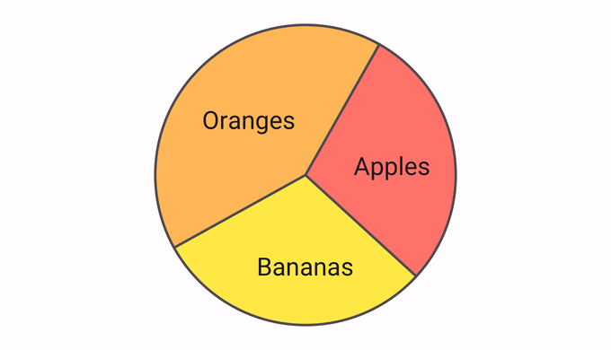

# ✅ Contrast for informative graphic elements

Wcag criterion: [📜 1.4.11 Non-Text Contrast - AA](..)

## Description

The contrast ratio of informative graphic elements (e.g. lines and curves in diagrams) to the surrounding colours is at least ‘3:1’. This applies to all visual cues that are necessary for perception and operation.

## Method

**Manual check:** Review content and look for weak contrasts. Determine contrast using Colour Contrast Analyser if necessary.

## Details on web applicability (specific test steps)

🇩🇪 Currently only available in German.

## Details on mobile applicability (additions to web)

🇩🇪 Currently only available in German.

## Details on PDF applicability (additions to web)

🇩🇪 Currently only available in German.

## Blind testable details

🇩🇪 Currently only available in German.

## Screenshots

### Statistisches Diagramm

### Kuchendiagramm

