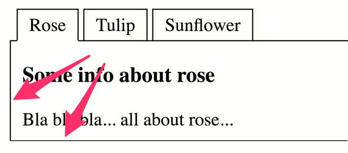

# ✅ Contrast ratio of control elements

Wcag criterion: [📜 1.4.11 Non-Text Contrast - AA](..)

## Description

The contrast ratio of control elements (e.g. text fields, radio buttons, checkboxes, buttons, tabs, etc.) to the surrounding colours is at least ‘3:1’. This applies to all visual cues that are required for perception and operation (e.g. form field boundaries, fold-out indicators for flyouts/dropdowns, tick in a checkbox, etc.), in particular also for the perception of the status of an element. The hover state of an element does not have to be distinguishable from the standard state.

## Method

**Manual check:** Look through elements, interact with them and look for weak contrasts. Contrast determination by Colour Contrast Analyser if necessary.

## Details on web applicability (specific test steps)

🇩🇪 Currently only available in German.

## Details on mobile applicability (additions to web)

🇩🇪 Currently only available in German.

## Details on PDF applicability (additions to web)

🇩🇪 Currently only available in German.

## Blind testable details

🇩🇪 Currently only available in German.

## Screenshots

### Textfeld

### Tabliste

