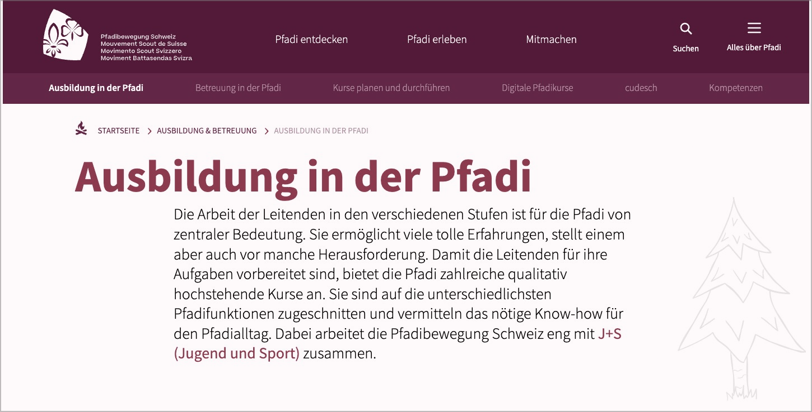
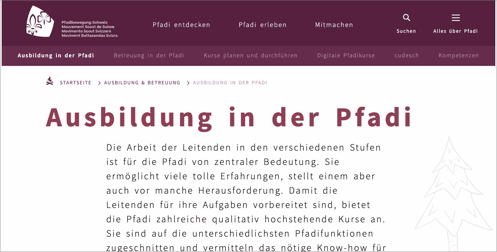

# ✅ Increasable spacing

Wcag criterion: [📜 1.4.12 Text Spacing - AA](..)

## Description

Spacing between lines, words and letters as well as after paragraphs can be increased by certain values without any resulting restrictions. Exceptions are: Subtitles in video content, PDF documents.

## Method

**Bookmarklet ‘Text Spacing’:** Execute and ensure that the content is adjusted as expected.

## Details on web applicability (specific test steps)

🇩🇪 Currently only available in German.

## Details on mobile applicability (additions to web)

🇩🇪 Currently only available in German.

## Details on PDF applicability (additions to web)

🇩🇪 Currently only available in German.

## Blind testable details

🇩🇪 Currently only available in German.

## Screenshots

## Videos

No videos available.
