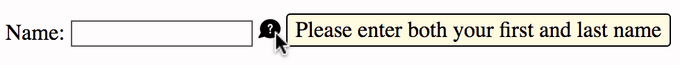
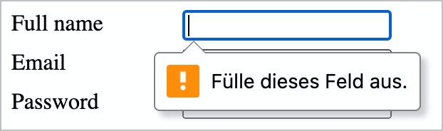

# ✅ Content via hover or focus

Wcag criterion: [📜 1.4.13 Content on Hover or Focus - AA](..)

## Description

Content that is displayed via hover or focus is not distracting and can be interacted with. The following three conditions are met: Content displayed via hover or focus can be hidden, hovered and is persistent.

## Method

**Manual check:** Look through elements, interact with them and make sure that they behave as expected: Can content be shown/hidden? Can content shown via hover also be hovered itself? Does content remain permanently displayed?

## Details on web applicability (specific test steps)

🇩🇪 Currently only available in German.

## Details on mobile applicability (additions to web)

🇩🇪 Currently only available in German.

## Details on PDF applicability (additions to web)

🇩🇪 Currently only available in German.

## Blind testable details

🇩🇪 Currently only available in German.

## Screenshots

## Videos

No videos available.
