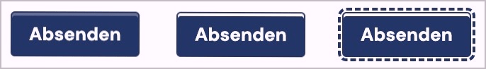

# ✅ Contrast of interactive text elements

Wcag criterion: [📜 1.4.3 Contrast (Minimum) - AA](..)

## Description

Interactive text elements (e.g. button labels) fulfill the contrast requirement of `4.5:1` in all states (focused, on mouseover, etc.) to the same extent. There are no strict contrast requirements for distinguishing between the states of an interactive element.

## Method

**Manual check:** Look through elements, interact with them and look for weak contrasts. Contrast determination by Colour Contrast Analyser if necessary.

## Details on web applicability (specific test steps)

🇩🇪 Currently only available in German.

## Details on mobile applicability (additions to web)

🇩🇪 Currently only available in German.

## Details on PDF applicability (additions to web)

🇩🇪 Currently only available in German.

## Blind testable details

🇩🇪 Currently only available in German.

## Screenshots

## Videos

🇩🇪 Currently only available in German.
