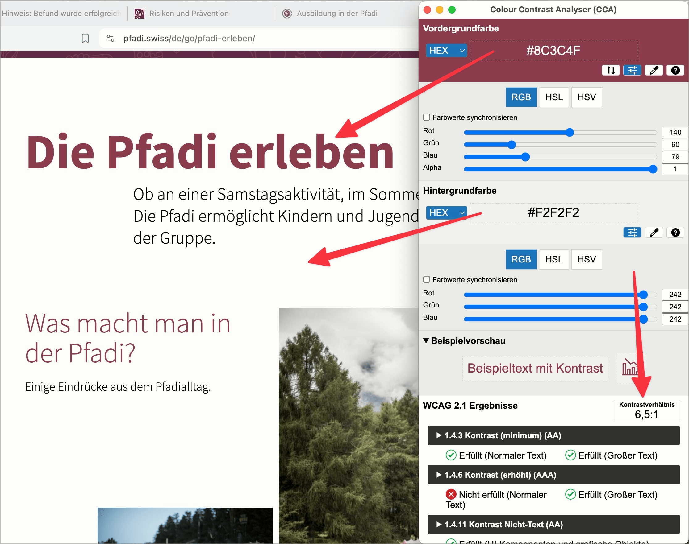

# ✅ Contrast ratio for text

## Description

The contrast ratio for text and images from text to background is at least `4.5:1` for normal font size and at least `3:1` for large font (defined as at least `18pt` or `14pt + bold`). This applies both for normal font to background color (all texts and notes) and for texts in informative graphic elements, but is not mandatory for logos or purely decorative graphics.

## Method

**Manual check:** Review content and look for weak contrasts. Determine contrast using Colour Contrast Analyser if necessary.

## Details on web applicability (specific test steps)

🇩🇪 Currently only available in German.

## Screenshots

