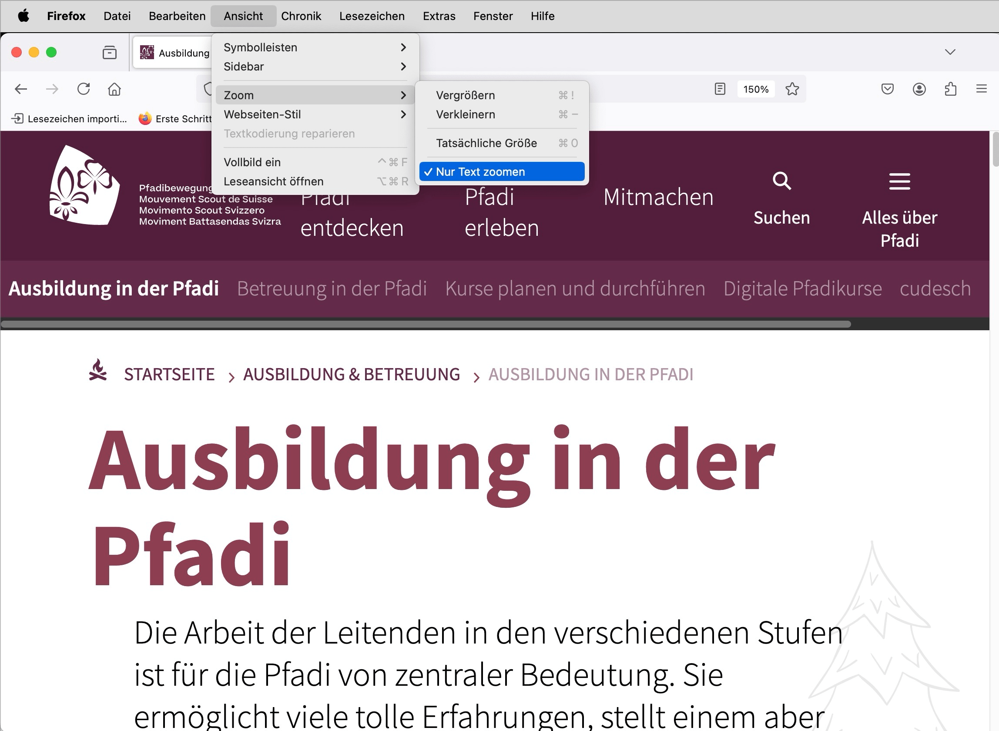

# ✅ 200% zoom

Wcag criterion: [📜 1.4.4 Resize text - AA](..)

## Description

Elements are zoomable to at least 200%, either the text alone or the entire page (usually ensured by the browser for websites, ensured by design and development for mobile apps).

## Method

**Browser:** Gradually increase the zoom to 200% and ensure that the content is adjusted as expected.

## Details on web applicability (specific test steps)

🇩🇪 Currently only available in German.

## Details on mobile applicability (additions to web)

🇩🇪 Currently only available in German.

## Details on PDF applicability (additions to web)

🇩🇪 Currently only available in German.

## Blind testable details

🇩🇪 Currently only available in German.

## Screenshots

## Videos

No videos available.
