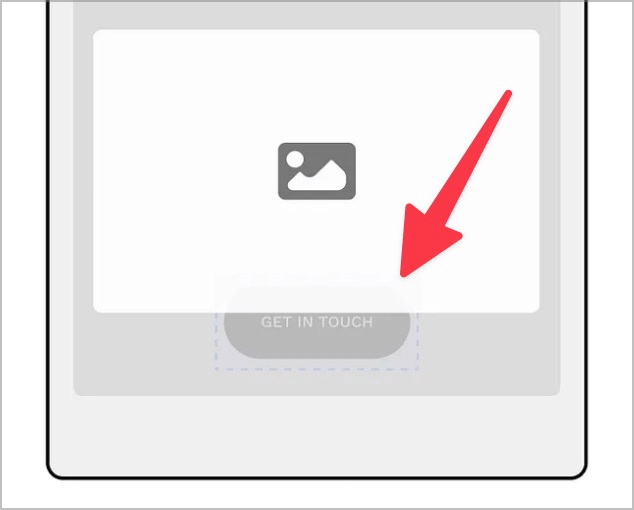

# Checkpoint: Focus visible

## Description

The keyboard focus is always clearly visible when navigating and is at most partially obscured by other elements.

## Method

**Keyboard:** Navigate through elements using the tab key and make sure that the focus is clearly visible.

## Details on web applicability (specific test steps)

🇩🇪 Currently only available in German.

## Screenshots

