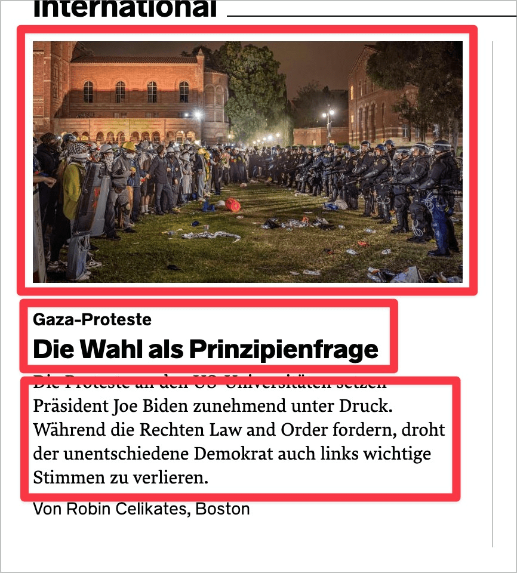

# Checkpoint: Multiple links

## Description

Multiple, different links (e.g. a headline, a graphic and an additional text link) to the same destination are avoided.

## Method

**Screenreader:** List links and check whether there are multiple links.

## Details on web applicability (specific test steps)

🇩🇪 Currently only available in German.

## Screenshots

