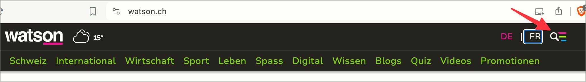

# ✅ Operable with the keyboard

Wcag criterion: [📜 2.1.1 Keyboard - A](..)

## Description

Content/functionalities (page functionalities, page elements, form fields, control elements, buttons, links, dialogues, multimedia controls, etc.) can be accessed with the keyboard alone (i.e. without a pointing device) and can be operated as expected.

## Method

**Keyboard:** Navigate through elements using the `Tab` key, interact with them and ensure that they behave as expected: Activate using the `Enter` or `Space` key, further interaction options often using `Arrow` keys.

## Details on web applicability (specific test steps)

🇩🇪 Currently only available in German.

## Details on mobile applicability (additions to web)

🇩🇪 Currently only available in German.

## Details on PDF applicability (additions to web)

🇩🇪 Currently only available in German.

## Blind testable details

🇩🇪 Currently only available in German.

## Screenshots

### Element nicht fokussierbar

Das Element zum Ausklappen des Hamburger-Menüs kann nicht fokussiert werden.

## Videos

🇩🇪 Currently only available in German.
