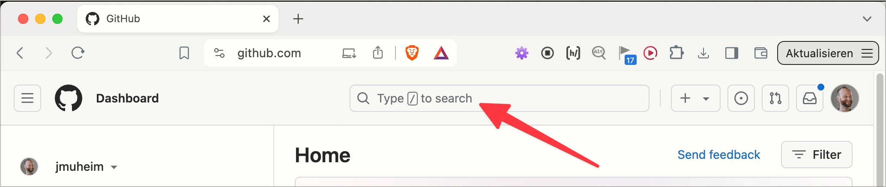
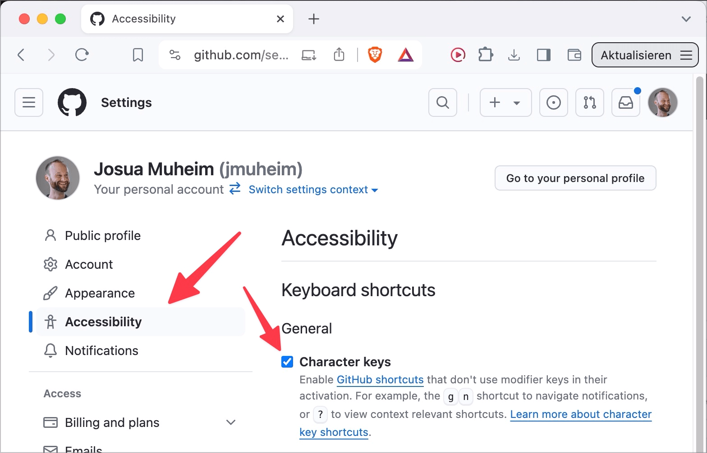

# ✅ Single-key shortcuts

Wcag criterion: [📜 2.1.4 Character Key Shortcuts - A](..)

## Description

Single-key shortcuts (consisting of a single letter, punctuation, number or symbol character key) can either be deactivated or changed or are only active with focus.

## Method

**Bookmarklet "Trigger keyboard shortcuts":** Execute and check for changes to the contents: Has an element changed somewhere, or has a new one appeared or disappeared? Has the focus been moved somewhere?

## Details on web applicability (specific test steps)

🇩🇪 Currently only available in German.

## Screenshots

