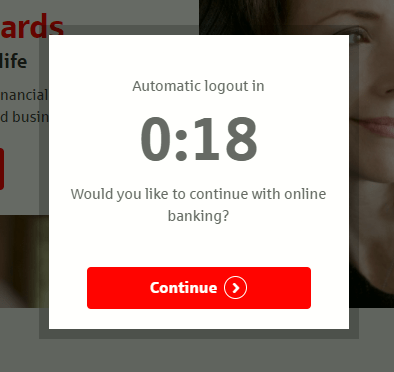
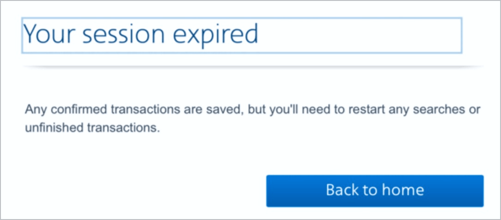
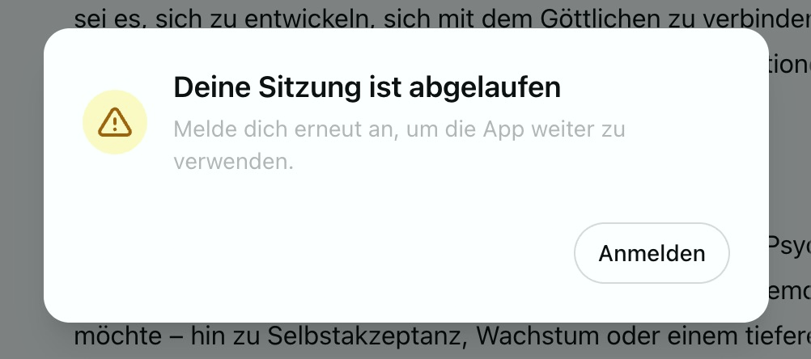
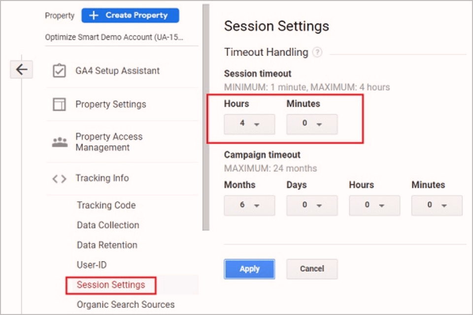
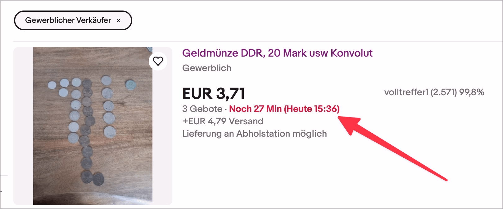

# ✅ Timeout intervals

Wcag criterion: [📜 2.2.1 Timing Adjustable - A](..)

## Description

Timeout intervals are customizable or can be deactivated. A clear indication of these options is required. The following applies to the customization options: Either the timeout can be set to at least ten times the default setting or a warning is issued before the timeout expires and at least 20 seconds are made available to extend the available time with a simple action (e.g. "Press the space bar"). This option must be used at least ten times.

## Method

**Manual check:** Run through processes and ensure that they behave as expected: Can time intervals be adjusted? Can they be experienced and extended at an early stage (also using a keyboard or screen reader)? If necessary, consult with the site operator to ensure that no time intervals are overlooked.

## Details on web applicability (specific test steps)

🇩🇪 Currently only available in German.

## Screenshots

