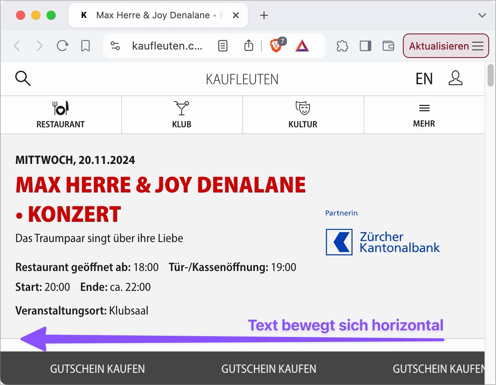
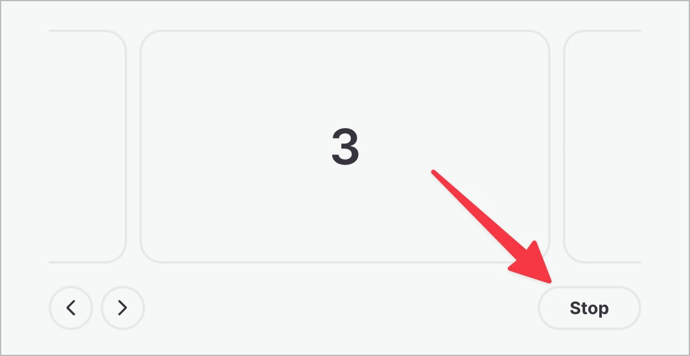

# ✅ Permanently animated content

Wcag criterion: [📜 2.2.2 Pause, Stop, Hide - A](..)

## Description

Permanently animated content (longer than five seconds) can be paused, stopped or faded out using clearly visible controls. Permanently animated content is content that moves and/or updates automatically, flashes or scrolls. They start automatically and are displayed in parallel with other content.

## Method

**Manual check:** Review content, interact with it and ensure that it behaves as expected: Can animated content be paused, stopped or faded out?

## Details on web applicability (specific test steps)

🇩🇪 Currently only available in German.

## Screenshots

