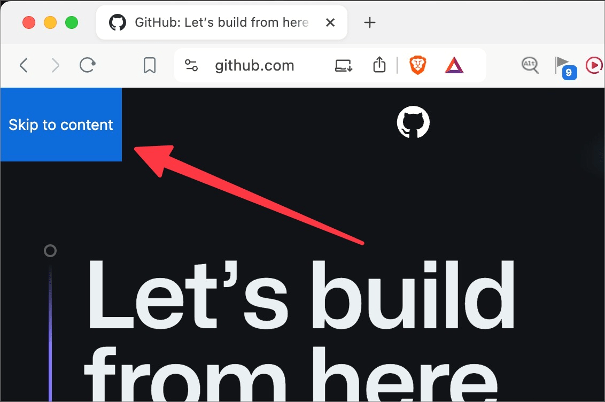
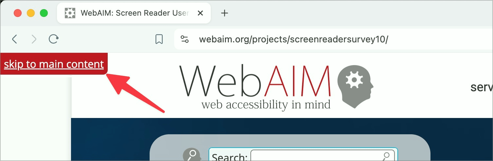
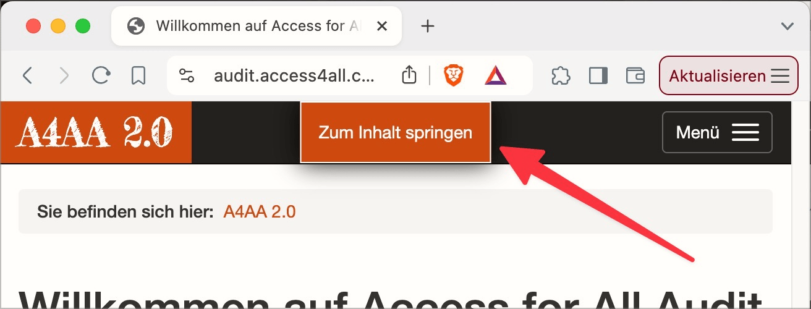

# ✅ Jump links

Wcag criterion: [📜 2.4.1 Bypass Blocks - A](..)

## Description

Jump links make it easy to skip repeating blocks of information (e.g. navigation, header area) using the keyboard.

## Method

**Keyboard:** After loading a page, press the Tab key directly and check whether the selected element is a jump link and whether it works as expected.

## Details on web applicability (specific test steps)

🇩🇪 Currently only available in German.

## Screenshots

