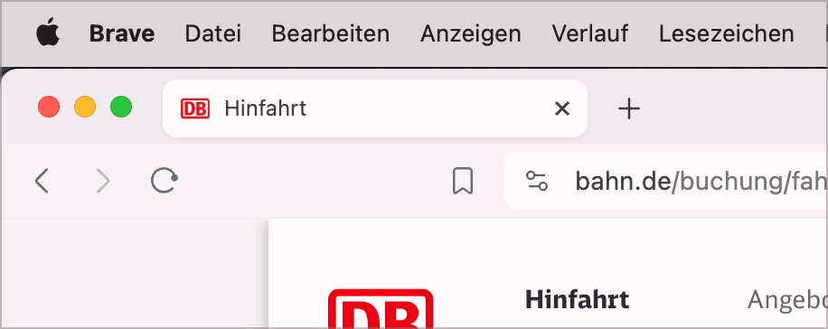
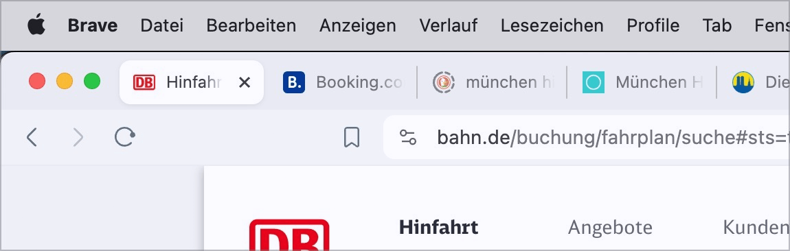
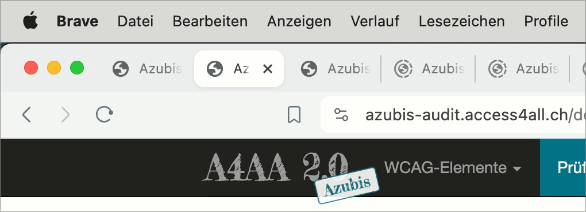

# ✅ Meaningful title

Wcag criterion: [📜 2.4.2 Page Titled - A](..)

## Description

Pages have a clear, meaningful title that contains the topic or purpose of the page and the operator (sample: 'Topic/purpose of the page - page operator')

## Method

**Manual check:** Look through the pages and make sure that their titles correspond to the expectations: Topic/purpose available? Operator present?

## Details on web applicability (specific test steps)

🇩🇪 Currently only available in German.

## Details on mobile applicability (additions to web)

🇩🇪 Currently only available in German.

## Details on PDF applicability (additions to web)

🇩🇪 Currently only available in German.

## Blind testable details

🇩🇪 Currently only available in German.

## Screenshots

### Einzelner Tab

Hier fehlt der Name der Seiten-Betreiber:in (Deutsche Bahn).

### Viele Tabs neben einander

Auch für visuelle Nutzer ist es hier sinnvoll, dass der Thema der Seite am Anfang des Titels steht.

Als Vergleich:

## Videos

No videos available.
