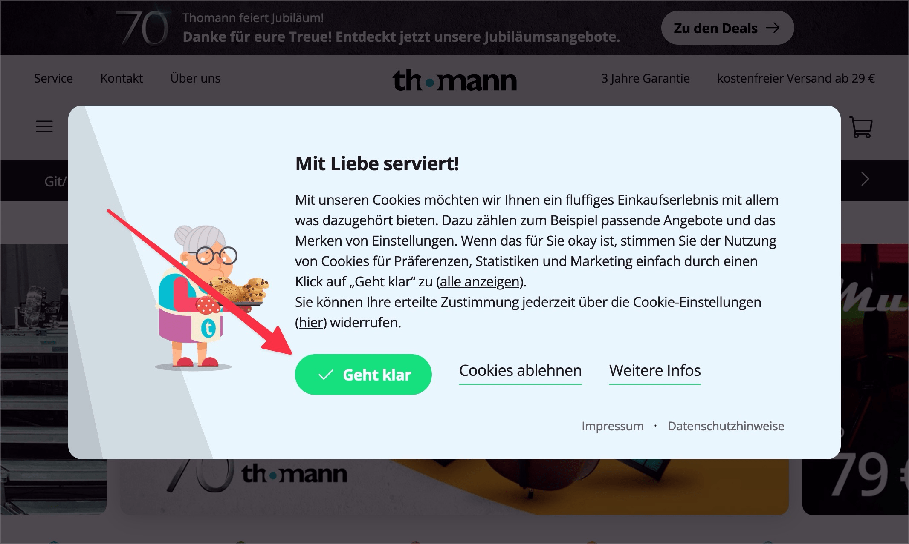

# ✅ Focus-Guidance

Wcag criterion: [📜 2.4.3 Focus Order - A](..)

## Description

The keyboard focus is guided sensibly when someone interacts with elements on the page that lead to a change within the page (without page reload), e.g. after clicking on a button that displays a dialogue (reaching the dialogue and interacting in the dialogue, exiting it, focus back on the element that triggered the dialogue, navigating further on the page). Interaction with form elements can also be optimised through sensible focus guidance.

## Method

**Keyboard:** Navigate through elements using the tab key, interact with them and make sure that the focus order and guidance makes sense.

## Details on web applicability (specific test steps)

🇩🇪 Currently only available in German.

## Details on mobile applicability (additions to web)

🇩🇪 Currently only available in German.

## Details on PDF applicability (additions to web)

🇩🇪 Currently only available in German.

## Blind testable details

🇩🇪 Currently only available in German.

## Screenshots

## Videos

🇩🇪 Currently only available in German.
