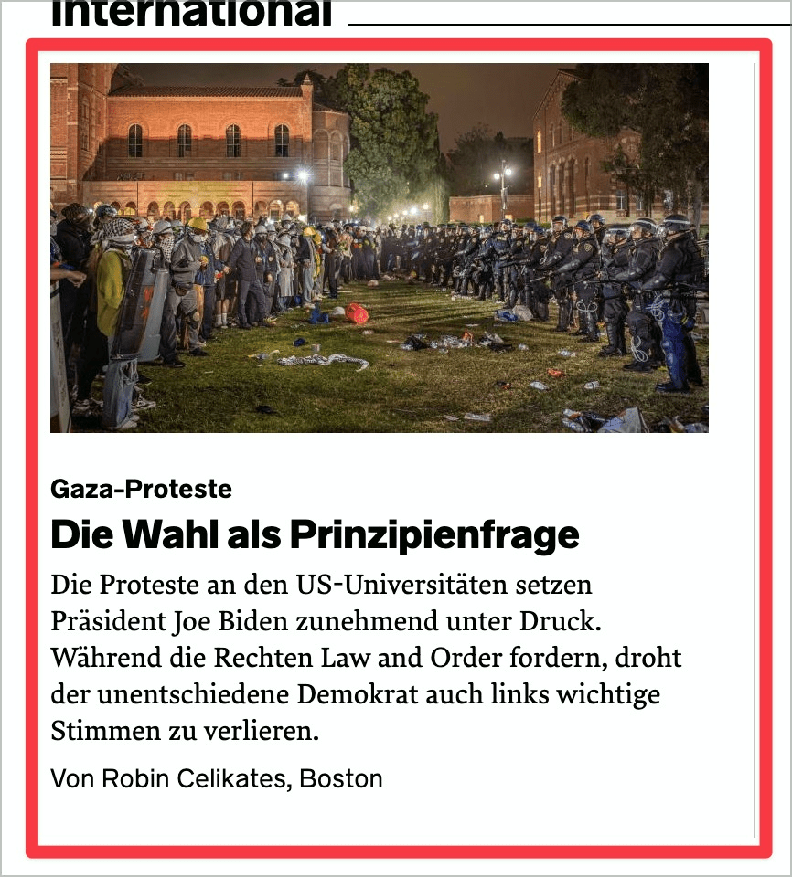

# ✅ Multiple links

Wcag criterion: [📜 2.4.4 Link Purpose (In Context) - A](..)

## Description

Multiple, different links (e.g. a headline, a graphic and an additional text link) to the same destination are avoided.

## Method

**Screenreader:** List links and check whether there are multiple links.

## Details on web applicability (specific test steps)

🇩🇪 Currently only available in German.

## Details on mobile applicability (additions to web)

🇩🇪 Currently only available in German.

## Details on PDF applicability (additions to web)

🇩🇪 Currently only available in German.

## Blind testable details

🇩🇪 Currently only available in German.

## Screenshots

